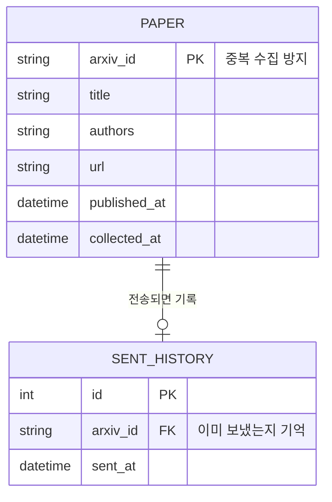

# ERD — cs.AI 신규 논문 주간 알림

`유스케이스.md`·`인터페이스정의서.md` 기반. 근거 없는 칼럼(예: 스케줄 재시도 상태 영속화)은 추가하지 않았다 — 인터페이스정의서에 해당 Store 함수가 없다.

## ERD

- **중복 수집 방지**: `PAPER.arxiv_id` — PK. 같은 논문 재수집돼도 upsert 대상이 하나로 고정됨.
- **이미 보냈는지 기억**: `SENT_HISTORY.arxiv_id` — 전송 이력 테이블. `get_unsent_papers`가 이 테이블과 대조해 미전송분만 골라낸다.

## 칼럼 출처 대조표

| 테이블 | 칼럼 | 출처 문장 |
|---|---|---|
| PAPER | arxiv_id (PK) | 유스케이스 UC-2 "이미 전송한 논문이 다시 전송되지 않게 걸러낸다" / 인터페이스정의서 `Paper.arxiv_id`, `get_unsent_papers` 대조 기준 |
| PAPER | title | 인터페이스정의서 `Paper.title` |
| PAPER | authors | 인터페이스정의서 `Paper.authors: list[str]` |
| PAPER | url | 인터페이스정의서 `Paper.url` |
| PAPER | published_at | 인터페이스정의서 `Paper.published_at` |
| PAPER | collected_at | 유스케이스 UC-1 "매주 월요일 정해진 시각에 cs.AI 신규 논문을 자동 수집" / 인터페이스정의서 `fetch_recent_papers` 반환 시점 |
| SENT_HISTORY | id (PK) | 인터페이스정의서 `save_sent_papers` — 저장 레코드 식별용(문서에 명시적 PK 없어 정규화 목적으로 추가) |
| SENT_HISTORY | arxiv_id (FK) | 유스케이스 UC-2 "전송 이력과 대조 → 미전송 논문만 선별" / 인터페이스정의서 `get_unsent_papers`, `save_sent_papers` |
| SENT_HISTORY | sent_at | 유스케이스 UC-1 "Discord 채널로 전송" / 인터페이스정의서 `save_sent_papers`가 "전송 완료된 논문을 전송 이력에 저장" |

## 제외한 것 (근거 부족)

- 스케줄 실행/재시도 상태(UC-3)를 저장하는 엔티티 — 인터페이스정의서에 해당 Store 함수 없음(`retry_job`은 상태 비저장, 단일 시도 결과만 bool 반환).
- 0건 알림 여부, 재시도 실패 시 알림 대상 — 유스케이스·인터페이스정의서 모두 "미확정 정책"으로 명시. 확정 후 갱신.
