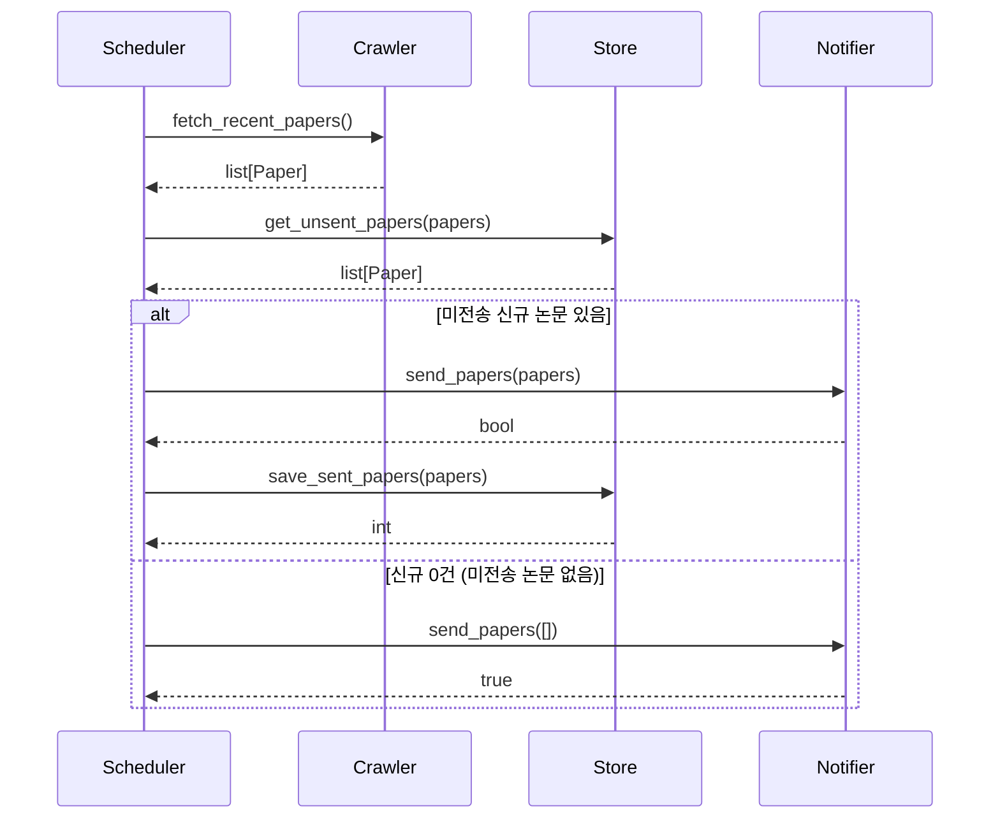

# 시퀀스 다이어그램 — cs.AI 신규 논문 주간 알림

`인터페이스정의서.md`의 함수 시그니처, `컴포넌트설계서.md`의 컴포넌트 이름 기준.

```mermaid
sequenceDiagram
    participant Scheduler
    participant Crawler
    participant Store
    participant Notifier

    Scheduler->>Crawler: fetch_recent_papers()
    Crawler-->>Scheduler: list[Paper]
    Scheduler->>Store: get_unsent_papers(papers)
    Store-->>Scheduler: list[Paper]

    alt 미전송 신규 논문 있음
        Scheduler->>Notifier: send_papers(papers)
        Notifier-->>Scheduler: bool
        Scheduler->>Store: save_sent_papers(papers)
        Store-->>Scheduler: int
    else 신규 0건 (미전송 논문 없음)
        Scheduler->>Notifier: send_papers([])
        Notifier-->>Scheduler: true
    end
```

